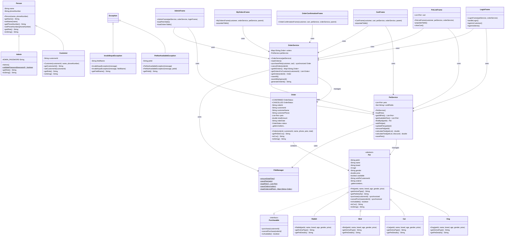

# Class Diagram — Pet Shop Management System

```mermaid
classDiagram
    class Person {
        -String name
        -String phoneNumber
        +Person(name, phoneNumber)
        +getName() String
        +setName(name)
        +getPhoneNumber() String
        +setPhoneNumber(phoneNumber)
        +getRole()* String
        +toString() String
    }

    class Customer {
        -String customerId
        +Customer(customerId, name, phoneNumber)
        +getCustomerId() String
        +setCustomerId(customerId)
        +getRole() String
        +toString() String
    }

    class Admin {
        -ADMIN_PASSWORD String
        +Admin()
        +validatePassword(password)$ boolean
        +getRole() String
        +toString() String
    }

    class Purchasable {
        <<interface>>
        +purchase(customerId)*
        +cancelPurchase(orderId)*
        +isAvailable()* boolean
    }

    class Pet {
        <<abstract>>
        -String petId
        -String name
        -String breed
        -int age
        -String gender
        -double price
        -boolean available
        -String soldToCustomerId
        -String orderId
        +Pet(petId, name, breed, age, gender, price)
        +getAnimalType()* String
        +getPetDetails()* String
        +purchase(customerId) synchronized
        +cancelPurchase(orderId) synchronized
        +isAvailable() boolean
        +toCsv() String
        +toString() String
        ..getters/setters..
    }

    class Dog {
        +Dog(petId, name, breed, age, gender, price)
        +getAnimalType() String
        +getPetDetails() String
    }

    class Cat {
        +Cat(petId, name, breed, age, gender, price)
        +getAnimalType() String
        +getPetDetails() String
    }

    class Bird {
        +Bird(petId, name, breed, age, gender, price)
        +getAnimalType() String
        +getPetDetails() String
    }

    class Rabbit {
        +Rabbit(petId, name, breed, age, gender, price)
        +getAnimalType() String
        +getPetDetails() String
    }

    class Order {
        +CONFIRMED OrderStatus
        +CANCELLED OrderStatus
        -String orderId
        -String customerId
        -String customerName
        -String customerPhone
        -List~Pet~ pets
        -double totalAmount
        -String orderDate
        -OrderStatus status
        +Order(orderId, customerId, name, phone, pets, total)
        +getPetIdsCsv() String
        +toCsv() String
        +toString() String
        ..getters/setters..
    }

    class PetNotAvailableException {
        -String petId
        +PetNotAvailableException(message)
        +PetNotAvailableException(message, petId)
        +getPetId() String
    }

    class InvalidInputException {
        -String fieldName
        +InvalidInputException(message)
        +InvalidInputException(message, fieldName)
        +getFieldName() String
    }

    class PetService {
        -List~Pet~ pets
        -Set~String~ soldPetIds
        +PetService()
        +loadPets()
        +getAllPets() List~Pet~
        +getAvailablePets() List~Pet~
        +findById(petId) Pet
        +addPet(pet)
        +updatePet(updated)
        +removePet(petId)
        +calculateTotal(petList) double
        +calculateTotal(petList, discount) double
        +savePets()
    }

    class OrderService {
        -Map~String,Order~ orders
        -PetService petService
        +OrderService(petService)
        +loadOrders()
        +purchasePets(customer, cart) synchronized Order
        +cancelOrder(orderId)
        +getAllOrders() Map~String,Order~
        +getOrdersForCustomer(customerId) List~Order~
        +getOrder(orderId) Order
        +saveAll()
        -saveInBackground()
        -generateOrderId() String
    }

    class FileManager {
        +ensureDataFiles()$
        +savePets(pets)$
        +loadPets()$ List~Pet~
        +saveOrders(orders)$
        +loadOrders(allPets)$ Map~String,Order~
    }

    class LoginFrame {
        +LoginFrame(petService, orderService)
        -handleLogin()
        -loginAsCustomer()
        -loginAsAdmin()
    }

    class PetListFrame {
        -List~Pet~ cart
        +PetListFrame(customer, petService, orderService)
        +populateTable()
        +clearCart()
    }

    class CartFrame {
        +CartFrame(customer, cart, petService, orderService, parent)
        +populateTable()
    }

    class OrderConfirmationFrame {
        +OrderConfirmationFrame(customer, cart, petService, orderService, parent)
    }

    class MyOrdersFrame {
        +MyOrdersFrame(customer, orderService, petService, parent)
        +populateTable()
    }

    class AdminFrame {
        +AdminFrame(petService, orderService, loginFrame)
        +loadPetsTable()
        +loadOrdersTable()
    }

    Person <|-- Customer
    Person <|-- Admin
    Pet <|-- Dog
    Pet <|-- Cat
    Pet <|-- Bird
    Pet <|-- Rabbit
    Pet ..|> Purchasable
    Exception <|-- PetNotAvailableException
    Exception <|-- InvalidInputException

    PetService --> Pet : manages
    PetService --> FileManager : uses
    OrderService --> Order : manages
    OrderService --> PetService : uses
    OrderService --> FileManager : uses
    Order --> Pet : contains

    LoginFrame --> PetService : uses
    LoginFrame --> OrderService : uses
    PetListFrame --> PetService : uses
    PetListFrame --> OrderService : uses
    CartFrame --> PetService : uses
    CartFrame --> OrderService : uses
    OrderConfirmationFrame --> OrderService : uses
    MyOrdersFrame --> OrderService : uses
    AdminFrame --> PetService : uses
    AdminFrame --> OrderService : uses
```
