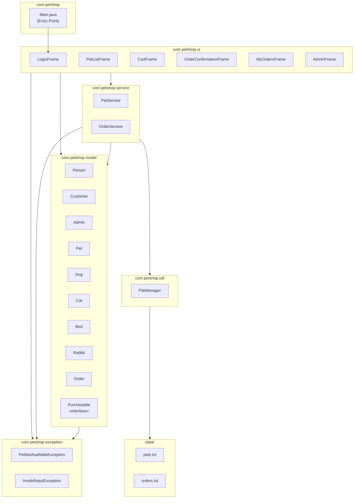

# Package Diagram — Pet Shop Management System

```mermaid
flowchart TD
    subgraph com.petshop
        Main["Main.java\n(Entry Point)"]
    end

    subgraph com.petshop.ui ["com.petshop.ui"]
        LoginFrame
        PetListFrame
        CartFrame
        OrderConfirmationFrame
        MyOrdersFrame
        AdminFrame
    end

    subgraph com.petshop.service ["com.petshop.service"]
        PetService
        OrderService
    end

    subgraph com.petshop.model ["com.petshop.model"]
        Person
        Customer
        Admin
        Pet
        Dog
        Cat
        Bird
        Rabbit
        Order
        Purchasable["Purchasable\n«interface»"]
    end

    subgraph com.petshop.util ["com.petshop.util"]
        FileManager
    end

    subgraph com.petshop.exception ["com.petshop.exception"]
        PetNotAvailableException
        InvalidInputException
    end

    subgraph data ["data/"]
        petsFile["pets.txt"]
        ordersFile["orders.txt"]
    end

    Main --> LoginFrame

    com.petshop.ui --> com.petshop.service
    com.petshop.ui --> com.petshop.model
    com.petshop.ui --> com.petshop.exception

    com.petshop.service --> com.petshop.model
    com.petshop.service --> com.petshop.util
    com.petshop.service --> com.petshop.exception

    com.petshop.util --> data
    com.petshop.model --> com.petshop.exception
```
